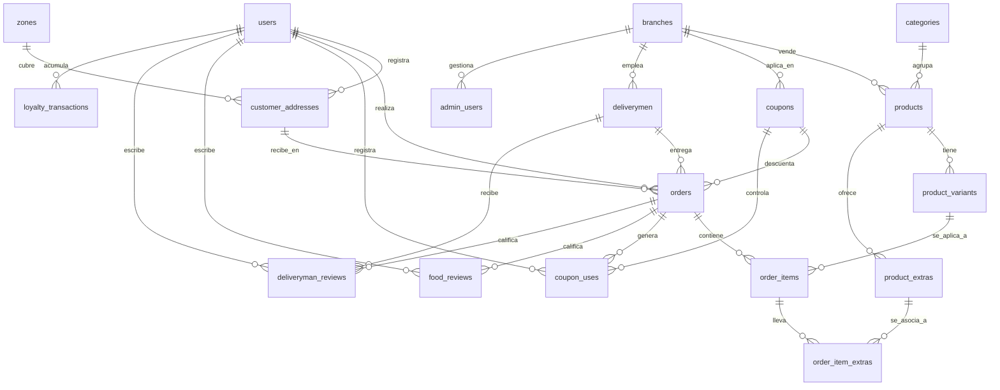

# Documentación Técnica: Base de Datos y Especificación de la API

Este documento contiene la especificación completa del diseño de la base de datos (diccionario de datos) y la documentación detallada de todos los endpoints de la API para la aplicación **pedidos_app_web (AXStore)**.

---

## Índice
1. [Sección 1: Diccionario de Datos (Base de Datos)](#sección-1-diccionario-de-datos-base-de-datos)
   - [Esquema de Relaciones (Mermaid)](#esquema-de-relaciones-mermaid)
   - [Detalle de Tablas](#detalle-de-tablas)
2. [Sección 2: Especificación y Documentación de la API](#sección-2-especificación-y-documentación-de-la-api)
   - [Información General y Seguridad](#información-general-y-seguridad)
   - [Catálogo de Endpoints de Clientes](#catálogo-de-endpoints-de-clientes)
   - [Catálogo de Endpoints de Repartidores](#catálogo-de-endpoints-de-repartidores)

---

## Sección 1: Diccionario de Datos (Base de Datos)

El sistema de base de datos está diseñado en MySQL/MariaDB bajo el ORM Eloquent de Laravel. Las relaciones cuentan con restricciones estrictas de clave foránea (`foreignKey`) y políticas de borrado en cascada (`cascadeOnDelete`) o restricción (`restrictOnDelete`) para garantizar la integridad referencial.

### Esquema de Relaciones (Mermaid)



---

### Detalle de Tablas

#### 1. `branches` (Sucursales)
Almacena las distintas sedes físicas del negocio. Permite configurar descuentos y segmentar zonas.

| Campo | Tipo | Nulo | Llave | Predeterminado | Descripción / Comentario |
| :--- | :--- | :---: | :---: | :--- | :--- |
| `id` | bigint UNSIGNED | No | Primary | *Autoincrement* | Identificador único de la sucursal. |
| `name` | varchar(100) | No | | | Nombre comercial (ej: Sucursal Norte). |
| `address` | varchar(255) | No | | | Dirección física completa. |
| `phone` | varchar(20) | No | | | Teléfono de contacto. |
| `city` | varchar(100) | No | | | Ciudad de ubicación. |
| `first_order_discount_percent` | decimal(5,2) | No | | `0.00` | % Descuento configurable en primer pedido (0 = inactivo). |
| `is_active` | boolean | No | | `true` | Si la sucursal está operando. |
| `created_at` | timestamp | Sí | | `NULL` | Fecha de creación del registro. |
| `updated_at` | timestamp | Sí | | `NULL` | Fecha de última modificación. |

#### 2. `admin_users` (Usuarios del Panel Administrativo)
Usuarios autorizados para acceder al panel de administración (Filament).

| Campo | Tipo | Nulo | Llave | Predeterminado | Descripción / Comentario |
| :--- | :--- | :---: | :---: | :--- | :--- |
| `id` | bigint UNSIGNED | No | Primary | *Autoincrement* | Identificador único. |
| `branch_id` | bigint UNSIGNED | Sí | Foreign | `NULL` | Sucursal asignada (NULL = Superadmin con acceso global). |
| `name` | varchar(100) | No | | | Nombre completo del administrador. |
| `email` | varchar(150) | No | Unique | | Correo electrónico de acceso. |
| `password` | varchar(255) | No | | | Contraseña encriptada (Bcrypt). |
| `role` | enum('super_admin', 'branch_admin', 'operator') | No | | `'operator'` | Rol administrativo asignado. |
| `is_active` | boolean | No | | `true` | Estado de habilitación. |
| `remember_token` | varchar(100) | Sí | | `NULL` | Token de sesión persistente. |
| `created_at` | timestamp | Sí | | `NULL` | Timestamps estándar. |
| `updated_at` | timestamp | Sí | | `NULL` | Timestamps estándar. |

#### 3. `users` (Clientes)
Almacena la información de los clientes registrados que consumen la app móvil.

| Campo | Tipo | Nulo | Llave | Predeterminado | Descripción / Comentario |
| :--- | :--- | :---: | :---: | :--- | :--- |
| `id` | bigint UNSIGNED | No | Primary | *Autoincrement* | Identificador único del cliente. |
| `name` | varchar(100) | No | | | Nombre completo. |
| `email` | varchar(150) | No | Unique | | Correo electrónico de acceso. |
| `phone` | varchar(20) | No | Unique | | Teléfono celular único (para SMS/OTP). |
| `password` | varchar(255) | No | | | Contraseña encriptada. |
| `email_verified_at` | timestamp | Sí | | `NULL` | Fecha de verificación de correo. |
| `profile_photo` | varchar(255) | Sí | | `NULL` | Ruta de imagen de perfil. |
| `is_active` | boolean | No | | `true` | FALSE si el usuario está bloqueado. |
| `loyalty_points` | int UNSIGNED | No | | `0` | Puntos acumulados por compras. |
| `total_completed_orders` | int UNSIGNED | No | | `0` | Historial total (sirve para promo del pedido gratis #11). |
| `remember_token` | varchar(100) | Sí | | `NULL` | Token de sesión. |
| `created_at` | timestamp | Sí | | `NULL` | Timestamps. |
| `updated_at` | timestamp | Sí | | `NULL` | Timestamps. |

#### 4. `deliverymen` (Repartidores)
Almacena los perfiles de los motoristas o repartidores.

| Campo | Tipo | Nulo | Llave | Predeterminado | Descripción / Comentario |
| :--- | :--- | :---: | :---: | :--- | :--- |
| `id` | bigint UNSIGNED | No | Primary | *Autoincrement* | Identificador único del repartidor. |
| `branch_id` | bigint UNSIGNED | Sí | Foreign | `NULL` | Sucursal fija asignada (NULL = Repartidor global). |
| `name` | varchar(100) | No | | | Nombre completo. |
| `email` | varchar(150) | No | Unique | | Correo único. |
| `phone` | varchar(20) | No | Unique | | Teléfono único de contacto. |
| `password` | varchar(255) | No | | | Contraseña encriptada. |
| `vehicle_type` | enum('motorcycle', 'bicycle', 'car') | No | | `'motorcycle'` | Medio de transporte. |
| `license_plate` | varchar(20) | Sí | | `NULL` | Placa del vehículo de entrega. |
| `is_available` | boolean | No | | `true` | Permite alternar disponibilidad en tiempo real. |
| `is_active` | boolean | No | | `true` | Desactivado bloquea el inicio de sesión. |
| `active_orders_count` | tinyint UNSIGNED | No | | `0` | Cantidad de pedidos activos (límite concurrente de 3). |
| `remember_token` | varchar(100) | Sí | | `NULL` | Token de sesión. |
| `created_at` | timestamp | Sí | | `NULL` | Timestamps. |
| `updated_at` | timestamp | Sí | | `NULL` | Timestamps. |

#### 5. `zones` (Zonas de Entrega / Cobertura)
Delimita las áreas donde el negocio tiene cobertura y define las tarifas de envío aplicables.

| Campo | Tipo | Nulo | Llave | Predeterminado | Descripción / Comentario |
| :--- | :--- | :---: | :---: | :--- | :--- |
| `id` | bigint UNSIGNED | No | Primary | *Autoincrement* | Identificador de zona. |
| `name` | varchar(100) | No | | | Nombre de zona (ej: "Colonia Escalón", "Zona Centro"). |
| `city` | varchar(100) | No | | | Ciudad a la que pertenece. |
| `delivery_fee` | decimal(8,2) | No | | `0.00` | Costo de envío aplicable a esta zona. |
| `is_deliverable` | boolean | No | | `true` | FALSE indica áreas sin cobertura temporal. |
| `is_active` | boolean | No | | `true` | Indica si la zona está operativa. |
| `created_at` | timestamp | Sí | | `NULL` | Timestamps. |
| `updated_at` | timestamp | Sí | | `NULL` | Timestamps. |

#### 6. `categories` (Categorías de Productos)
Clasifica los alimentos o productos disponibles (ej: Hamburguesas, Bebidas).

| Campo | Tipo | Nulo | Llave | Predeterminado | Descripción / Comentario |
| :--- | :--- | :---: | :---: | :--- | :--- |
| `id` | bigint UNSIGNED | No | Primary | *Autoincrement* | Identificador único de categoría. |
| `name` | varchar(100) | No | | | Nombre de la categoría. |
| `image` | varchar(255) | Sí | | `NULL` | Enlace a imagen/icono descriptivo. |
| `sort_order` | int UNSIGNED | No | | `0` | Criterio de ordenamiento para despliegue móvil. |
| `is_active` | boolean | No | | `true` | Permite apagar toda una categoría de golpe. |
| `created_at` | timestamp | Sí | | `NULL` | Timestamps. |
| `updated_at` | timestamp | Sí | | `NULL` | Timestamps. |

#### 7. `products` (Productos / Alimentos)
Tabla que almacena los artículos o platos principales que ofrece el negocio.

| Campo | Tipo | Nulo | Llave | Predeterminado | Descripción / Comentario |
| :--- | :--- | :---: | :---: | :--- | :--- |
| `id` | bigint UNSIGNED | No | Primary | *Autoincrement* | Identificador único. |
| `category_id` | bigint UNSIGNED | No | Foreign | | Enlace a la categoría correspondiente. |
| `branch_id` | bigint UNSIGNED | Sí | Foreign | `NULL` | Sucursal exclusiva (NULL = Disponible en todas). |
| `name` | varchar(150) | No | | | Nombre comercial del plato/alimento. |
| `description` | text | Sí | | `NULL` | Descripción detallada de ingredientes. |
| `time_preparation` | varchar(255) | Sí | | `NULL` | Tiempo aproximado de preparación (ej: "15-20 min"). |
| `base_price` | decimal(8,2) | No | | | Precio de venta básico (sin extras ni variantes). |
| `stars` | decimal(2,1) | Sí | | `0.0` | Calificación promedio de estrellas (calculado). |
| `image` | varchar(255) | Sí | | `NULL` | Enlace URL al almacenamiento (Storage) de la imagen. |
| `is_available` | boolean | No | | `true` | FALSE indica agotamiento (oculto en la app móvil). |
| `is_recommended` | boolean | No | | `false` | Bandera de destacado/recomendado. |
| `is_popular` | boolean | No | | `false` | Bandera de artículo popular/tendencia. |
| `created_at` | timestamp | Sí | | `NULL` | Timestamps. |
| `updated_at` | timestamp | Sí | | `NULL` | Timestamps. |

#### 8. `customer_addresses` (Direcciones del Cliente)
Direcciones personales registradas por los clientes.

| Campo | Tipo | Nulo | Llave | Predeterminado | Descripción / Comentario |
| :--- | :--- | :---: | :---: | :--- | :--- |
| `id` | bigint UNSIGNED | No | Primary | *Autoincrement* | Identificador de la dirección. |
| `user_id` | bigint UNSIGNED | No | Foreign | | Cliente propietario. |
| `zone_id` | bigint UNSIGNED | No | Foreign | | Zona de entrega ligada (obtiene la tarifa de envío). |
| `label` | varchar(50) | No | | | Etiqueta del lugar (ej: "Casa", "Trabajo"). |
| `street` | varchar(255) | No | | | Dirección exacta de calle y número de casa. |
| `references` | varchar(255) | Sí | | `NULL` | Señales o indicaciones para el repartidor. |
| `latitude` | decimal(10,8) | Sí | | `NULL` | Coordenada GPS de latitud. |
| `longitude` | decimal(11,8) | Sí | | `NULL` | Coordenada GPS de longitud. |
| `is_default` | boolean | No | | `false` | Indica si es la dirección predeterminada del cliente. |
| `created_at` | timestamp | Sí | | `NULL` | Timestamps. |
| `updated_at` | timestamp | Sí | | `NULL` | Timestamps. |

#### 9. `product_variants` (Variantes del Producto)
Permite modificar el producto con opciones de tamaño, término de carne, etc.

| Campo | Tipo | Nulo | Llave | Predeterminado | Descripción / Comentario |
| :--- | :--- | :---: | :---: | :--- | :--- |
| `id` | bigint UNSIGNED | No | Primary | *Autoincrement* | Identificador único de variante. |
| `product_id` | bigint UNSIGNED | No | Foreign | | Producto al que pertenece. |
| `name` | varchar(100) | No | | | Nombre de variante (ej: "Grande", "Término medio"). |
| `price_modifier` | decimal(8,2) | No | | `0.00` | Suma o resta al `base_price` (ej: `2.00` o `-0.50`). |
| `is_default` | boolean | No | | `false` | Si viene seleccionada por defecto. |
| `is_available` | boolean | No | | `true` | Si la variante se encuentra en stock. |
| `created_at` | timestamp | Sí | | `NULL` | Timestamps. |
| `updated_at` | timestamp | Sí | | `NULL` | Timestamps. |

#### 10. `product_extras` (Ingredientes Extras)
Complementos que el usuario puede añadir pagando un extra (ej: Doble queso, Tocino).

| Campo | Tipo | Nulo | Llave | Predeterminado | Descripción / Comentario |
| :--- | :--- | :---: | :---: | :--- | :--- |
| `id` | bigint UNSIGNED | No | Primary | *Autoincrement* | Identificador único del extra. |
| `product_id` | bigint UNSIGNED | No | Foreign | | Producto al que complementa. |
| `name` | varchar(100) | No | | | Nombre del extra (ej: "Doble Queso"). |
| `price` | decimal(8,2) | No | | `0.00` | Precio unitario del extra. |
| `is_available` | boolean | No | | `true` | Si está disponible para compra. |
| `created_at` | timestamp | Sí | | `NULL` | Timestamps. |
| `updated_at` | timestamp | Sí | | `NULL` | Timestamps. |

#### 11. `coupons` (Cupones de Descuento)
Cupones promocionales que reducen el monto de un pedido.

| Campo | Tipo | Nulo | Llave | Predeterminado | Descripción / Comentario |
| :--- | :--- | :---: | :---: | :--- | :--- |
| `id` | bigint UNSIGNED | No | Primary | *Autoincrement* | Identificador único. |
| `branch_id` | bigint UNSIGNED | Sí | Foreign | `NULL` | Sucursal específica (NULL = Válido en todas). |
| `code` | varchar(50) | No | Unique | | Código alfanumérico a ingresar (ej: "DESCUENTO10"). |
| `description` | varchar(255) | Sí | | `NULL` | Detalle informativo del beneficio. |
| `type` | enum('percent', 'fixed', 'free_delivery') | No | | | Tipo de beneficio. |
| `value` | decimal(8,2) | No | | `0.00` | % o monto. `0.00` si es `free_delivery`. |
| `min_order_amount` | decimal(8,2) | No | | `0.00` | Compra mínima para poder ser aplicado. |
| `max_uses_total` | int UNSIGNED | Sí | | `NULL` | Límite global de usos de este cupón (NULL = ilimitado). |
| `used_count` | int UNSIGNED | No | | `0` | Contador de canjes totales realizados. |
| `expires_at` | timestamp | Sí | | `NULL` | Fecha de expiración. |
| `is_active` | boolean | No | | `true` | Estado de activación. |
| `created_at` | timestamp | Sí | | `NULL` | Timestamps. |
| `updated_at` | timestamp | Sí | | `NULL` | Timestamps. |

#### 12. `orders` (Pedidos)
Tabla maestra de ventas. Almacena las transacciones calculadas en el servidor.

| Campo | Tipo | Nulo | Llave | Predeterminado | Descripción / Comentario |
| :--- | :--- | :---: | :---: | :--- | :--- |
| `id` | bigint UNSIGNED | No | Primary | *Autoincrement* | ID del pedido. |
| `user_id` | bigint UNSIGNED | No | Foreign | | Cliente que realiza el pedido. |
| `branch_id` | bigint UNSIGNED | No | Foreign | | Sucursal desde la que se despacha. |
| `deliveryman_id` | bigint UNSIGNED | Sí | Foreign | `NULL` | Repartidor asignado al pedido. |
| `address_id` | bigint UNSIGNED | No | Foreign | | Dirección seleccionada. |
| `coupon_id` | bigint UNSIGNED | Sí | Foreign | `NULL` | Cupón aplicado si existe. |
| `otp` | varchar(4) | Sí | | `NULL` | Código secreto de 4 dígitos para entregar con validación. |
| `status` | enum('pending', 'confirmed', 'preparing', 'assigned', 'on_way', 'delivered', 'cancelled') | No | Index | `'pending'` | Estado actual del pedido. |
| `subtotal` | decimal(8,2) | No | | | Suma neta de ítems + variantes + extras. |
| `delivery_fee` | decimal(8,2) | No | | | Cargo de envío (leído de la zona del cliente). |
| `discount_amount` | decimal(8,2) | No | | `0.00` | Descuento total aplicado server-side. |
| `total` | decimal(8,2) | No | | | Total a cobrar final (`subtotal + delivery_fee - discount`). |
| `is_first_order_promo` | boolean | No | | `false` | Si aplicó promo de primera compra de la sucursal. |
| `is_free_delivery_promo` | boolean | No | | `false` | Si aplicó el delivery gratis por ser el pedido número 11. |
| `is_loyalty_discount` | boolean | No | | `false` | Si canjeó puntos de lealtad para rebajar envío. |
| `cancellation_reason` | varchar(255) | Sí | | `NULL` | Explicación escrita del por qué se canceló. |
| `cancelled_at` | timestamp | Sí | | `NULL` | Fecha de cancelación. |
| `confirmed_at` | timestamp | Sí | | `NULL` | Fecha de confirmación en la tienda. |
| `assigned_at` | timestamp | Sí | | `NULL` | Fecha en la que el repartidor tomó el pedido. |
| `delivered_at` | timestamp | Sí | | `NULL` | Fecha de recepción en manos del cliente. |
| `created_at` | timestamp | Sí | | `NULL` | Fecha de creación del pedido. |
| `updated_at` | timestamp | Sí | | `NULL` | Fecha de actualización. |

#### 13. `coupon_uses` (Bitácora de Uso de Cupones)
Registra qué clientes han usado qué cupones. **Garantiza 1 único uso por cliente a nivel DB**.

| Campo | Tipo | Nulo | Llave | Predeterminado | Descripción / Comentario |
| :--- | :--- | :---: | :---: | :--- | :--- |
| `id` | bigint UNSIGNED | No | Primary | *Autoincrement* | Identificador de uso. |
| `coupon_id` | bigint UNSIGNED | No | Foreign | | Cupón consumido. |
| `user_id` | bigint UNSIGNED | No | Foreign | | Cliente que lo utilizó. |
| `order_id` | bigint UNSIGNED | No | Foreign | | Pedido donde se aplicó el cupón. |
| `used_at` | timestamp | No | | *CURRENT_TIMESTAMP* | Fecha exacta de la compra. |

*Nota: Cuenta con un índice único compuesto: `UNIQUE(coupon_id, user_id)`.*

#### 14. `order_items` (Detalle de Alimentos del Pedido)
Almacena el listado de productos individuales solicitados en un pedido.

| Campo | Tipo | Nulo | Llave | Predeterminado | Descripción / Comentario |
| :--- | :--- | :---: | :---: | :--- | :--- |
| `id` | bigint UNSIGNED | No | Primary | *Autoincrement* | ID del ítem del pedido. |
| `order_id` | bigint UNSIGNED | No | Foreign | | Pedido contenedor. |
| `product_id` | bigint UNSIGNED | No | Foreign | | Producto solicitado. |
| `variant_id` | bigint UNSIGNED | Sí | Foreign | `NULL` | Variante elegida (ej: Término medio). |
| `quantity` | tinyint UNSIGNED | No | | `1` | Cantidad comprada (1 a 20). |
| `unit_price` | decimal(8,2) | No | | | Snapshot del precio al comprar (`base_price + price_modifier`). |
| `subtotal` | decimal(8,2) | No | | | Subtotal del ítem (`unit_price × quantity`). |
| `created_at` | timestamp | Sí | | `NULL` | Timestamps. |
| `updated_at` | timestamp | Sí | | `NULL` | Timestamps. |

#### 15. `order_item_extras` (Extras Asignados a los Ítems)
Guarda la bitácora de extras elegidos para un producto del pedido.

| Campo | Tipo | Nulo | Llave | Predeterminado | Descripción / Comentario |
| :--- | :--- | :---: | :---: | :--- | :--- |
| `id` | bigint UNSIGNED | No | Primary | *Autoincrement* | Identificador. |
| `order_item_id` | bigint UNSIGNED | No | Foreign | | Ítem de pedido que lleva el extra. |
| `extra_id` | bigint UNSIGNED | No | Foreign | | Complemento seleccionado. |
| `quantity` | tinyint UNSIGNED | No | | `1` | Cantidad del extra aplicada (1 a 5). |
| `unit_price` | decimal(8,2) | No | | | Snapshot del precio cobrado por este extra. |

#### 16. `food_reviews` (Reseñas del Producto/Alimento)
Calificaciones de los clientes sobre los alimentos del pedido.

| Campo | Tipo | Nulo | Llave | Predeterminado | Descripción / Comentario |
| :--- | :--- | :---: | :---: | :--- | :--- |
| `id` | bigint UNSIGNED | No | Primary | *Autoincrement* | Identificador. |
| `order_id` | bigint UNSIGNED | No | Unique | | Pedido calificado (máx 1 reseña por pedido). |
| `user_id` | bigint UNSIGNED | No | Foreign | | Cliente calificador. |
| `rating` | tinyint UNSIGNED | No | | | Estrellas otorgadas (1 a 5). |
| `comment` | text | Sí | | `NULL` | Comentario de texto libre. |
| `created_at` | timestamp | Sí | | `NULL` | Timestamps. |
| `updated_at` | timestamp | Sí | | `NULL` | Timestamps. |

#### 17. `deliveryman_reviews` (Reseñas de la Entrega/Repartidor)
Calificaciones hechas por los clientes sobre el servicio prestado por el repartidor.

| Campo | Tipo | Nulo | Llave | Predeterminado | Descripción / Comentario |
| :--- | :--- | :---: | :---: | :--- | :--- |
| `id` | bigint UNSIGNED | No | Primary | *Autoincrement* | Identificador. |
| `order_id` | bigint UNSIGNED | No | Unique | | Pedido calificado. |
| `user_id` | bigint UNSIGNED | No | Foreign | | Cliente que reseña. |
| `deliveryman_id` | bigint UNSIGNED | No | Foreign | | Repartidor evaluado. |
| `rating` | tinyint UNSIGNED | No | | | Estrellas del servicio (1 a 5). |
| `comment` | text | Sí | | `NULL` | Comentario libre. |
| `created_at` | timestamp | Sí | | `NULL` | Timestamps. |
| `updated_at` | timestamp | Sí | | `NULL` | Timestamps. |

#### 18. `loyalty_transactions` (Bitácora de Puntos de Lealtad)
Movimientos de acumulación y consumo de puntos de lealtad de la cartera de clientes.

| Campo | Tipo | Nulo | Llave | Predeterminado | Descripción / Comentario |
| :--- | :--- | :---: | :---: | :--- | :--- |
| `id` | bigint UNSIGNED | No | Primary | *Autoincrement* | Identificador. |
| `user_id` | bigint UNSIGNED | No | Foreign | | Cliente afectado. |
| `order_id` | bigint UNSIGNED | Sí | Foreign | `NULL` | Pedido que generó o consumió los puntos. |
| `type` | enum('earned', 'redeemed') | No | | | Tipo de transacción: ganado o redimido. |
| `points` | int | No | | | Puntos (+ gana, - canjea). |
| `description` | varchar(255) | No | | | Descripción explicativa. |
| `created_at` | timestamp | No | | *CURRENT_TIMESTAMP* | Fecha de registro. |

#### 19. `personal_access_tokens` (Tokens Personales de Sanctum)
Tokens de autenticación Bearer generados por Laravel Sanctum para los clientes y repartidores.

| Campo | Tipo | Nulo | Llave | Predeterminado | Descripción / Comentario |
| :--- | :--- | :---: | :---: | :--- | :--- |
| `id` | bigint UNSIGNED | No | Primary | *Autoincrement* | Identificador del token. |
| `tokenable_type` | varchar(255) | No | Index | | Modelo relacionado (`App\Models\User` o `App\Models\Deliveryman`). |
| `tokenable_id` | bigint UNSIGNED | No | Index | | ID del registro autenticado. |
| `name` | varchar(255) | No | | | Nombre descriptivo del token (ej: "mobile-app"). |
| `token` | varchar(64) | No | Unique | | Hash SHA-256 único del token. |
| `abilities` | text | Sí | | `NULL` | Habilidades del token. |
| `last_used_at` | timestamp | Sí | | `NULL` | Última vez que se usó el token. |
| `expires_at` | timestamp | Sí | | `NULL` | Fecha de vencimiento. |
| `created_at` | timestamp | Sí | | `NULL` | Timestamps. |
| `updated_at` | timestamp | Sí | | `NULL` | Timestamps. |

#### 20. Tablas del Sistema de Laravel
Tablas generadas por el framework para control del flujo de trabajo asíncrono y almacenamiento local de sesiones.
- **`jobs`**: Tabla que encola los trabajos y envíos de notificaciones en background.
- **`failed_jobs`**: Historial de fallas de tareas asíncronas para depuración.
- **`job_batches`**: Registros para rastreo de lotes de trabajos en cola.
- **`sessions`**: Almacenamiento rápido de sesiones del navegador del panel Filament.
- **`cache` / `cache_locks`**: Llaves de valor rápido para cachear catálogos (evita sobreconsulta a base de datos en endpoints de lectura).

---

## Sección 2: Especificación y Documentación de la API

La API REST opera bajo el estándar de respuesta unificado JSON y se expone a través de un túnel Cloudflare HTTPS seguro.

* **URL Base de la API**: `https://publication-missed-introduce-communist.trycloudflare.com`
* **Prefijo Global de Versión**: `/api/v1`
* **Puerto**: `443` (HTTPS Estándar)

### Información General y Seguridad

#### 1. Encabezados HTTP Obligatorios (Headers)
Para interactuar correctamente con todos los endpoints, el cliente debe incluir:
```http
Accept: application/json
Content-Type: application/json
```
Para rutas que requieren autenticación, se debe incluir el token devuelto en los endpoints de inicio de sesión o registro:
```http
Authorization: Bearer {tu_token_sanctum}
```

#### 2. Estructura de Respuesta Común (API Response)
* **Respuesta Exitosa (200 OK / 201 Created)**:
  ```json
  {
    "success": true,
    "message": "Mensaje informativo.",
    "data": { ... }
  }
  ```
* **Respuesta de Error de Validación (422 Unprocessable Entity)**:
  ```json
  {
    "success": false,
    "message": "Error de validación.",
    "errors": {
      "campo_fallido": ["Explicación detallada del error de validación."]
    }
  }
  ```
* **Respuesta de Error Genérico (401 Unauthorized / 403 Forbidden / 404 Not Found / 500 Server Error)**:
  ```json
  {
    "success": false,
    "message": "Explicación del error de autenticación, permisos o falla interna."
  }
  ```

#### 3. Límites de Peticiones (Rate Limiters)
* **Auth**: Máximo 5 peticiones por minuto (`throttle:auth`).
* **API General**: Máximo 60 peticiones por minuto (`throttle:api`).

---

### Catálogo de Endpoints de Clientes

#### ── A. Autenticación y Perfil (Clientes)

##### 1. Registro de Cliente
* **Ruta**: `POST` [https://publication-missed-introduce-communist.trycloudflare.com/api/v1/auth/register](https://publication-missed-introduce-communist.trycloudflare.com/api/v1/auth/register)
* **Autenticación**: Pública
* **Parámetros en el Body (JSON)**:
  - `name` (string, requerido): Nombre del cliente.
  - `email` (string, requerido): Correo único.
  - `phone` (string, requerido): Teléfono único.
  - `password` (string, requerido, mín 8): Contraseña.
  - `password_confirmation` (string, requerido): Confirmación.

  *Ejemplo Body:*
  ```json
  {
    "name": "Juan Pérez",
    "email": "juan@example.com",
    "phone": "+50378901234",
    "password": "password123",
    "password_confirmation": "password123"
  }
  ```

* **Respuesta Esperada (201 Created)**:
  ```json
  {
    "success": true,
    "message": "Registro exitoso.",
    "data": {
      "user": {
        "id": 1,
        "name": "Juan Pérez",
        "email": "juan@example.com",
        "phone": "+50378901234",
        "profile_photo": null,
        "is_active": true,
        "loyalty_points": 0,
        "total_completed_orders": 0
      },
      "token": "1|PlaintextTokenSanctum...",
      "token_type": "Bearer"
    }
  }
  ```

##### 2. Inicio de Sesión (Login)
* **Ruta**: `POST` [https://publication-missed-introduce-communist.trycloudflare.com/api/v1/auth/login](https://publication-missed-introduce-communist.trycloudflare.com/api/v1/auth/login)
* **Autenticación**: Pública
* **Parámetros en el Body (JSON)**:
  - `email` (string, requerido): Correo.
  - `password` (string, requerido): Contraseña.

  *Ejemplo Body:*
  ```json
  {
    "email": "juan@example.com",
    "password": "password123"
  }
  ```

* **Respuesta Esperada (200 OK)**:
  ```json
  {
    "success": true,
    "message": "Inicio de sesión exitoso.",
    "data": {
      "user": {
        "id": 1,
        "name": "Juan Pérez",
        "email": "juan@example.com",
        "phone": "+50378901234",
        "profile_photo": null,
        "is_active": true,
        "loyalty_points": 150,
        "total_completed_orders": 10
      },
      "token": "2|PlaintextTokenSanctum...",
      "token_type": "Bearer"
    }
  }
  ```

##### 3. Cerrar Sesión (Logout)
* **Ruta**: `POST` [https://publication-missed-introduce-communist.trycloudflare.com/api/v1/auth/logout](https://publication-missed-introduce-communist.trycloudflare.com/api/v1/auth/logout)
* **Autenticación**: Requiere Token Bearer
* **Respuesta Esperada (200 OK)**:
  ```json
  {
    "success": true,
    "message": "Sesión cerrada exitosamente.",
    "data": null
  }
  ```

##### 4. Obtener mi Perfil (`me`)
* **Ruta**: `GET` [https://publication-missed-introduce-communist.trycloudflare.com/api/v1/auth/me](https://publication-missed-introduce-communist.trycloudflare.com/api/v1/auth/me)
* **Autenticación**: Requiere Token Bearer
* **Respuesta Esperada (200 OK)**:
  ```json
  {
    "success": true,
    "message": "OK",
    "data": {
      "user": {
        "id": 1,
        "name": "Juan Pérez",
        "email": "juan@example.com",
        "phone": "+50378901234",
        "profile_photo": null,
        "is_active": true,
        "loyalty_points": 150,
        "total_completed_orders": 10
      }
    }
  }
  ```

##### 5. Actualizar Datos Personales
* **Ruta**: `PUT` [https://publication-missed-introduce-communist.trycloudflare.com/api/v1/auth/update-profile](https://publication-missed-introduce-communist.trycloudflare.com/api/v1/auth/update-profile)
* **Autenticación**: Requiere Token Bearer
* **Parámetros en el Body (JSON)**:
  - `name` (string, requerido, máx 100).
  - `phone` (string, requerido, máx 20, único).

* **Respuesta Esperada (200 OK)**:
  ```json
  {
    "success": true,
    "message": "Perfil actualizado exitosamente.",
    "data": {
      "user": {
        "id": 1,
        "name": "Juan Carlos Pérez",
        "email": "juan@example.com",
        "phone": "+50377778888",
        "profile_photo": null,
        "is_active": true,
        "loyalty_points": 150,
        "total_completed_orders": 10
      }
    }
  }
  ```

##### 6. Cambiar Contraseña
* **Ruta**: `PUT` [https://publication-missed-introduce-communist.trycloudflare.com/api/v1/auth/change-password](https://publication-missed-introduce-communist.trycloudflare.com/api/v1/auth/change-password)
* **Autenticación**: Requiere Token Bearer
* **Parámetros en el Body (JSON)**:
  - `current_password` (string, requerido).
  - `new_password` (string, requerido, mín 8).

* **Respuesta Esperada (200 OK)**:
  ```json
  {
    "success": true,
    "message": "Contraseña actualizada exitosamente."
  }
  ```

---

#### ── B. Configuración y Cobertura (Público)

##### 7. Listar Sucursales
* **Ruta**: `GET` [https://publication-missed-introduce-communist.trycloudflare.com/api/v1/branches](https://publication-missed-introduce-communist.trycloudflare.com/api/v1/branches)
* **Autenticación**: Pública
* **Respuesta Esperada (200 OK)**:
  ```json
  {
    "data": [
      {
        "id": 1,
        "name": "Sucursal Central",
        "address": "Calle Principal #123",
        "phone": "2222-3333",
        "city": "Capital",
        "first_order_discount_percent": "10.00",
        "is_active": true
      }
    ]
  }
  ```

##### 8. Listar Zonas con Cobertura
* **Ruta**: `GET` [https://publication-missed-introduce-communist.trycloudflare.com/api/v1/zones](https://publication-missed-introduce-communist.trycloudflare.com/api/v1/zones)
* **Autenticación**: Pública
* **Respuesta Esperada (200 OK)**:
  ```json
  {
    "success": true,
    "message": "Zonas de entrega.",
    "data": [
      {
        "id": 1,
        "name": "Zona Centro",
        "city": "Capital",
        "delivery_fee": "2.00",
        "is_deliverable": true,
        "is_active": true
      }
    ]
  }
  ```

---

#### ── C. Catálogo de Alimentos (Categorías y Productos)

##### 9. Listar Categorías Activas
* **Ruta**: `GET` [https://publication-missed-introduce-communist.trycloudflare.com/api/v1/categories](https://publication-missed-introduce-communist.trycloudflare.com/api/v1/categories)
* **Autenticación**: Requiere Token Bearer
* **Parámetros Query (Opcional)**:
  - `branch_id` (integer): Filtra y calcula la cantidad de productos en stock disponibles exclusivamente para esta sucursal.

* **Respuesta Esperada (200 OK)**:
  ```json
  {
    "success": true,
    "message": "Listado de categorías.",
    "data": [
      {
        "id": 1,
        "name": "Hamburguesas",
        "products_count": 8
      },
      {
        "id": 2,
        "name": "Bebidas",
        "products_count": 12
      }
    ]
  }
  ```

##### 10. Listar Catálogo de Productos
* **Ruta**: `GET` [https://publication-missed-introduce-communist.trycloudflare.com/api/v1/products](https://publication-missed-introduce-communist.trycloudflare.com/api/v1/products)
* **Autenticación**: Requiere Token Bearer
* **Parámetros Query (Opcionales)**:
  - `branch_id` (integer): Mostrar productos de la sucursal o los globales.
  - `category_id` (integer): Filtrar por ID de la categoría.
  - `search` (string): Busca texto en el nombre o descripción.
  - `recommended` (boolean/integer): `true` o `1` trae solo destacados.
  - `popular` (boolean/integer): `true` o `1` trae solo populares.
  - `per_page` (integer): Tamaño de página (defecto 15, máx 50).

* **Respuesta Esperada (200 OK, Estilo Paginación)**:
  ```json
  {
    "data": [
      {
        "id": 1,
        "name": "Hamburguesa Clásica",
        "description": "Doble carne a la parrilla, queso y aderezo especial",
        "time_preparation": "10-15 min",
        "base_price": "5.50",
        "base_price_fmt": "$5.50",
        "stars": "4.5",
        "image": "https://publication-missed-introduce-communist.trycloudflare.com/storage/products/hamburguesa_clasica.jpg",
        "is_available": true,
        "is_recommended": true,
        "is_popular": true,
        "category": {
          "id": 1,
          "name": "Hamburguesas"
        }
      }
    ],
    "links": {
      "first": "URL/products?page=1",
      "last": "URL/products?page=3",
      "prev": null,
      "next": "URL/products?page=2"
    },
    "meta": {
      "current_page": 1,
      "last_page": 3,
      "per_page": 15,
      "total": 42
    }
  }
  ```

##### 11. Detalle del Producto (con Variantes y Extras)
* **Ruta**: `GET` [https://publication-missed-introduce-communist.trycloudflare.com/api/v1/products/{product_id}](https://publication-missed-introduce-communist.trycloudflare.com/api/v1/products/1)
* **Autenticación**: Requiere Token Bearer
* **Parámetros URL**:
  - `product_id` (integer, requerido): ID numérico del producto en la URL.

* **Respuesta Esperada (200 OK)**:
  ```json
  {
    "success": true,
    "message": "Detalle del producto.",
    "data": {
      "id": 1,
      "name": "Hamburguesa Clásica",
      "description": "Doble carne a la parrilla, queso y aderezo especial",
      "time_preparation": "10-15 min",
      "base_price": "5.50",
      "base_price_fmt": "$5.50",
      "stars": "4.5",
      "image": "https://publication-missed-introduce-communist.trycloudflare.com/storage/products/hamburguesa.jpg",
      "is_available": true,
      "is_recommended": true,
      "is_popular": true,
      "category": {
        "id": 1,
        "name": "Hamburguesas"
      },
      "variants": [
        {
          "id": 1,
          "name": "Tamaño Grande",
          "price_modifier": "2.00",
          "price_modifier_fmt": "+$2.00",
          "is_default": false,
          "is_available": true
        }
      ],
      "extras": [
        {
          "id": 5,
          "name": "Tocino Extra",
          "price": "1.25",
          "price_fmt": "$1.25",
          "is_available": true
        }
      ]
    }
  }
  ```

---

#### ── D. Direcciones Personales de Entrega

##### 12. Listar mis Direcciones
* **Ruta**: `GET` [https://publication-missed-introduce-communist.trycloudflare.com/api/v1/addresses](https://publication-missed-introduce-communist.trycloudflare.com/api/v1/addresses)
* **Autenticación**: Requiere Token Bearer
* **Respuesta Esperada (200 OK)**:
  ```json
  {
    "success": true,
    "message": "Listado de direcciones.",
    "data": [
      {
        "id": 3,
        "label": "Casa",
        "street": "Col. Escalón, Calle 5 #42",
        "references": "Frente al parque principal",
        "latitude": "13.70123400",
        "longitude": "-89.21345600",
        "is_default": true,
        "zone": {
          "id": 1,
          "name": "Zona Centro"
        }
      }
    ]
  }
  ```

##### 13. Registrar Dirección de Entrega
* **Ruta**: `POST` [https://publication-missed-introduce-communist.trycloudflare.com/api/v1/addresses](https://publication-missed-introduce-communist.trycloudflare.com/api/v1/addresses)
* **Autenticación**: Requiere Token Bearer
* **Parámetros en el Body (JSON)**:
  - `zone_id` (integer, requerido): ID de la zona con cobertura.
  - `label` (string, requerido, máx 50): Alias (ej: "Casa", "Oficina").
  - `street` (string, requerido, máx 255): Dirección de calle y número.
  - `references` (string, opcional, máx 255): Indicaciones.
  - `latitude` (numeric, opcional): Entre -90 y 90.
  - `longitude` (numeric, opcional): Entre -180 y 180.
  - `is_default` (boolean, opcional): Marcar como favorita.

  *Ejemplo Body:*
  ```json
  {
    "zone_id": 1,
    "label": "Trabajo",
    "street": "Blvd. Los Héroes, Torre Central #4",
    "references": "Frente al banco, portón azul",
    "latitude": 13.715,
    "longitude": -89.224,
    "is_default": true
  }
  ```

* **Respuesta Esperada (201 Created)**:
  ```json
  {
    "success": true,
    "message": "Dirección creada exitosamente.",
    "data": {
      "id": 4,
      "label": "Trabajo",
      "street": "Blvd. Los Héroes, Torre Central #4",
      "references": "Frente al banco, portón azul",
      "latitude": "13.71500000",
      "longitude": "-89.22400000",
      "is_default": true,
      "zone": {
        "id": 1,
        "name": "Zona Centro"
      }
    }
  }
  ```

##### 14. Actualizar Dirección
* **Ruta**: `PUT` [https://publication-missed-introduce-communist.trycloudflare.com/api/v1/addresses/{address_id}](https://publication-missed-introduce-communist.trycloudflare.com/api/v1/addresses/4)
* **Autenticación**: Requiere Token Bearer
* **Parámetros URL**:
  - `address_id` (integer, requerido): ID de la dirección en la ruta.
* **Parámetros Body (JSON, Opcionales para edición parcial)**:
  *(Mismos campos del registro: zone_id, label, street, references, latitude, longitude, is_default)*

* **Respuesta Esperada (200 OK)**:
  ```json
  {
    "success": true,
    "message": "Dirección actualizada exitosamente.",
    "data": {
      "id": 4,
      "label": "Trabajo (Editado)",
      "street": "Blvd. Los Héroes, Torre Central #4",
      "references": "Piso 3, Oficina 302",
      "latitude": "13.71500000",
      "longitude": "-89.22400000",
      "is_default": true,
      "zone": {
        "id": 1,
        "name": "Zona Centro"
      }
    }
  }
  ```

##### 15. Eliminar Dirección
* **Ruta**: `DELETE` [https://publication-missed-introduce-communist.trycloudflare.com/api/v1/addresses/{address_id}](https://publication-missed-introduce-communist.trycloudflare.com/api/v1/addresses/4)
* **Autenticación**: Requiere Token Bearer
* **Regla de Negocio**: No se permite borrar una dirección si tiene pedidos activos asociados (pendientes, asignados, en camino, preparando).
* **Respuesta Esperada (200 OK)**:
  ```json
  {
    "success": true,
    "message": "Dirección eliminada exitosamente.",
    "data": null
  }
  ```

---

#### ── E. Pedidos de Clientes (Checkout y Estados)

##### 16. Crear Pedido (Checkout Seguro Server-Side)
El backend calcula todos los precios basándose estrictamente en las llaves primarias en la base de datos para impedir fraude en precios alterados por clientes.
* **Ruta**: `POST` [https://publication-missed-introduce-communist.trycloudflare.com/api/v1/orders](https://publication-missed-introduce-communist.trycloudflare.com/api/v1/orders)
* **Autenticación**: Requiere Token Bearer
* **Parámetros en el Body (JSON)**:
  - `branch_id` (integer, requerido): ID de la sucursal despacho.
  - `address_id` (integer, requerido): ID de la dirección registrada.
  - `coupon_code` (string, opcional): Código alfanumérico del cupón.
  - `use_loyalty_points` (boolean, opcional): Redimir puntos de lealtad (aplica 5% descuento sobre delivery).
  - `notes` (string, opcional, máx 500): Indicaciones para cocina.
  - `items` (array, requerido, mínimo 1):
    - `items[].product_id` (integer, requerido).
    - `items[].variant_id` (integer, opcional).
    - `items[].quantity` (integer, requerido, entre 1 y 20).
    - `items[].extras` (array, opcional):
      - `items[].extras[].extra_id` (integer, requerido).
      - `items[].extras[].quantity` (integer, requerido, entre 1 y 5).

  *Ejemplo Body:*
  ```json
  {
    "branch_id": 1,
    "address_id": 3,
    "coupon_code": "BIENVENIDO10",
    "use_loyalty_points": false,
    "notes": "Por favor sin cebolla y aderezos aparte.",
    "items": [
      {
        "product_id": 1,
        "variant_id": 1,
        "quantity": 2,
        "extras": [
          {
            "extra_id": 5,
            "quantity": 1
          }
        ]
      }
    ]
  }
  ```

* **Respuesta Esperada (201 Created)**:
  ```json
  {
    "success": true,
    "message": "Pedido creado exitosamente.",
    "data": {
      "id": 16,
      "status": "pending",
      "subtotal": "16.25",
      "subtotal_fmt": "$16.25",
      "delivery_fee": "2.00",
      "delivery_fee_fmt": "$2.00",
      "discount_amount": "1.63",
      "discount_amount_fmt": "$1.63",
      "total": "16.62",
      "total_fmt": "$16.62",
      "is_first_order_promo": false,
      "is_free_delivery_promo": false,
      "is_loyalty_discount": false,
      "otp": "4815",
      "notes": "Por favor sin cebolla y aderezos aparte.",
      "created_at": "17 May 2026, 01:30 PM"
    }
  }
  ```

##### 17. Listar mis Pedidos (Historial)
* **Ruta**: `GET` [https://publication-missed-introduce-communist.trycloudflare.com/api/v1/orders](https://publication-missed-introduce-communist.trycloudflare.com/api/v1/orders)
* **Autenticación**: Requiere Token Bearer
* **Parámetros Query (Opcionales)**:
  - `status` (string): Filtra por estado (`pending`, `confirmed`, `preparing`, `assigned`, `on_way`, `delivered`, `cancelled`).
  - `per_page` (integer): Paginación.

* **Respuesta Esperada (200 OK)**:
  ```json
  {
    "data": [
      {
        "id": 16,
        "status": "pending",
        "subtotal": "16.25",
        "subtotal_fmt": "$16.25",
        "delivery_fee": "2.00",
        "delivery_fee_fmt": "$2.00",
        "discount_amount": "1.63",
        "discount_amount_fmt": "$1.63",
        "total": "16.62",
        "total_fmt": "$16.62",
        "branch": {
          "id": 1,
          "name": "Sucursal Central",
          "address": "Calle Principal #123"
        },
        "items": [
          {
            "id": 25,
            "product_name": "Hamburguesa Clásica",
            "variant_name": "Tamaño Grande",
            "quantity": 2,
            "unit_price": "7.50",
            "unit_price_fmt": "$7.50",
            "subtotal": "15.00",
            "subtotal_fmt": "$15.00"
          }
        ],
        "is_first_order_promo": false,
        "is_free_delivery_promo": false,
        "is_loyalty_discount": false,
        "notes": "Por favor sin cebolla y aderezos aparte.",
        "created_at": "17 May 2026, 01:30 PM"
      }
    ]
  }
  ```

##### 18. Detalle Completo de Pedido
* **Ruta**: `GET` [https://publication-missed-introduce-communist.trycloudflare.com/api/v1/orders/{order_id}](https://publication-missed-introduce-communist.trycloudflare.com/api/v1/orders/16)
* **Autenticación**: Requiere Token Bearer
* **Respuesta Esperada (200 OK)**:
  ```json
  {
    "success": true,
    "message": "Detalle del pedido.",
    "data": {
      "id": 16,
      "status": "pending",
      "subtotal": "16.25",
      "subtotal_fmt": "$16.25",
      "delivery_fee": "2.00",
      "delivery_fee_fmt": "$2.00",
      "discount_amount": "1.63",
      "discount_amount_fmt": "$1.63",
      "total": "16.62",
      "total_fmt": "$16.62",
      "branch": {
        "id": 1,
        "name": "Sucursal Central",
        "address": "Calle Principal #123"
      },
      "address": {
        "id": 3,
        "label": "Casa",
        "street": "Col. Escalón, Calle 5 #42"
      },
      "items": [
        {
          "id": 25,
          "product_name": "Hamburguesa Clásica",
          "variant_name": "Tamaño Grande",
          "quantity": 2,
          "unit_price": "7.50",
          "unit_price_fmt": "$7.50",
          "subtotal": "15.00",
          "subtotal_fmt": "$15.00",
          "extras": [
            {
              "id": 12,
              "extra_name": "Tocino Extra",
              "quantity": 1,
              "unit_price": "1.25",
              "unit_price_fmt": "$1.25"
            }
          ]
        }
      ],
      "coupon_code": "BIENVENIDO10",
      "is_first_order_promo": false,
      "is_free_delivery_promo": false,
      "is_loyalty_discount": false,
      "notes": "Por favor sin cebolla y aderezos aparte.",
      "confirmed_at": null,
      "delivered_at": null,
      "created_at": "17 May 2026, 01:30 PM"
    }
  }
  ```

##### 19. Cancelar Pedido
* **Ruta**: `POST` [https://publication-missed-introduce-communist.trycloudflare.com/api/v1/orders/{order_id}/cancel](https://publication-missed-introduce-communist.trycloudflare.com/api/v1/orders/16/cancel)
* **Autenticación**: Requiere Token Bearer
* **Regla de Negocio**: Solo se puede cancelar si el estado actual es `pending` o `confirmed`. Si la cocina ya lo cambió a `preparing` (en preparación), el endpoint retornará error 422.
* **Parámetros en el Body (JSON)**:
  - `cancellation_reason` (string, opcional, máx 255): Causa de la cancelación.

* **Respuesta Esperada (200 OK)**:
  ```json
  {
    "success": true,
    "message": "Pedido cancelado exitosamente.",
    "data": {
      "id": 16,
      "status": "cancelled",
      "cancellation_reason": "Cambié de opinión",
      "cancelled_at": "17 May 2026, 01:35 PM"
    }
  }
  ```

---

### Catálogo de Endpoints de Repartidores

#### ── F. Autenticación de Repartidores

##### 20. Iniciar Sesión (Repartidores)
* **Ruta**: `POST` [https://publication-missed-introduce-communist.trycloudflare.com/api/v1/delivery/auth/login](https://publication-missed-introduce-communist.trycloudflare.com/api/v1/delivery/auth/login)
* **Autenticación**: Pública
* **Parámetros en el Body (JSON)**:
  - `email` (string, requerido): Correo del repartidor.
  - `password` (string, requerido): Contraseña.

* **Respuesta Esperada (200 OK)**:
  ```json
  {
    "success": true,
    "message": "Inicio de sesión exitoso.",
    "data": {
      "deliveryman": {
        "id": 1,
        "name": "Carlos Motorista",
        "email": "carlos@delivery.com",
        "phone": "+50370001111",
        "vehicle_type": "motorcycle",
        "license_plate": "M-88991",
        "is_active": true,
        "is_available": true,
        "branch_id": 1,
        "average_rating": 4.8,
        "total_reviews": 32
      },
      "token": "3|PlaintextTokenSanctumRepartidor...",
      "token_type": "Bearer"
    }
  }
  ```

##### 21. Perfil del Repartidor (`me`)
* **Ruta**: `GET` [https://publication-missed-introduce-communist.trycloudflare.com/api/v1/delivery/auth/me](https://publication-missed-introduce-communist.trycloudflare.com/api/v1/delivery/auth/me)
* **Autenticación**: Requiere Token Bearer
* **Respuesta Esperada (200 OK)**:
  ```json
  {
    "success": true,
    "message": "OK",
    "data": {
      "deliveryman": {
        "id": 1,
        "name": "Carlos Motorista",
        "email": "carlos@delivery.com",
        "phone": "+50370001111",
        "vehicle_type": "motorcycle",
        "license_plate": "M-88991",
        "is_active": true,
        "is_available": true,
        "branch_id": 1,
        "average_rating": 4.8,
        "total_reviews": 32
      }
    }
  }
  ```

##### 22. Actualizar Perfil y Disponibilidad
* **Ruta**: `PUT` [https://publication-missed-introduce-communist.trycloudflare.com/api/v1/delivery/auth/update-profile](https://publication-missed-introduce-communist.trycloudflare.com/api/v1/delivery/auth/update-profile)
* **Autenticación**: Requiere Token Bearer
* **Parámetros en el Body (JSON, Opcionales para edición parcial)**:
  - `name` (string): Nombre.
  - `phone` (string): Teléfono (único).
  - `is_available` (boolean): `true` para recibir pedidos, `false` para detener flujo.

* **Respuesta Esperada (200 OK)**:
  ```json
  {
    "success": true,
    "message": "Perfil actualizado exitosamente.",
    "data": {
      "deliveryman": {
        "id": 1,
        "name": "Carlos Motorista (Actualizado)",
        "email": "carlos@delivery.com",
        "phone": "+50370002222",
        "vehicle_type": "motorcycle",
        "license_plate": "M-88991",
        "is_active": true,
        "is_available": false,
        "branch_id": 1,
        "average_rating": 4.8,
        "total_reviews": 32
      }
    }
  }
  ```

##### 23. Cerrar Sesión (Repartidores)
* **Ruta**: `POST` [https://publication-missed-introduce-communist.trycloudflare.com/api/v1/delivery/auth/logout](https://publication-missed-introduce-communist.trycloudflare.com/api/v1/delivery/auth/logout)
* **Autenticación**: Requiere Token Bearer
* **Respuesta Esperada (200 OK)**:
  ```json
  {
    "success": true,
    "message": "Sesión cerrada exitosamente.",
    "data": null
  }
  ```

---

#### ── G. Pedidos y Operaciones del Repartidor

##### 24. Listar Pedidos Disponibles para Entrega
* **Ruta**: `GET` [https://publication-missed-introduce-communist.trycloudflare.com/api/v1/delivery/orders/available](https://publication-missed-introduce-communist.trycloudflare.com/api/v1/delivery/orders/available)
* **Autenticación**: Requiere Token Bearer
* **Regla de Negocio**:
  - El repartidor debe estar en modo "Disponible" (`is_available = true`), de lo contrario recibe 403 Forbidden.
  - Si el repartidor tiene un `branch_id` fijo, solo verá pedidos cocinándose en su sucursal.
  - Si su `branch_id` es NULL (Global), verá todos los pedidos listos a nivel general.
  - Los pedidos devueltos están en estado `preparing` (Preparando/Listos para recoger).

* **Respuesta Esperada (200 OK)**:
  ```json
  {
    "success": true,
    "message": "Listado de pedidos disponibles.",
    "data": {
      "orders": [
        {
          "id": 16,
          "status": "preparing",
          "subtotal": "16.25",
          "delivery_fee": "2.00",
          "total": "16.62",
          "branch_id": 1,
          "address": {
            "street": "Col. Escalón, Calle 5 #42",
            "references": "Frente al parque"
          },
          "user": {
            "name": "Juan Pérez",
            "phone": "+50378901234"
          }
        }
      ]
    }
  }
  ```

##### 25. Aceptar un Pedido (Auto-asignación)
* **Ruta**: `POST` [https://publication-missed-introduce-communist.trycloudflare.com/api/v1/delivery/orders/{order_id}/accept](https://publication-missed-introduce-communist.trycloudflare.com/api/v1/delivery/orders/16/accept)
* **Autenticación**: Requiere Token Bearer
* **Regla de Negocio**: Cambia el estado del pedido a `assigned`, estampa la fecha `assigned_at` y vincula al `deliveryman_id` logueado. Retorna error 422 si otro repartidor ya lo ganó en paralelo.
* **Respuesta Esperada (200 OK)**:
  ```json
  {
    "success": true,
    "message": "Has aceptado el pedido exitosamente.",
    "data": {
      "order": {
        "id": 16,
        "status": "assigned",
        "deliveryman_id": 1,
        "assigned_at": "2026-05-17T13:42:00.000000Z",
        "address": {
          "street": "Col. Escalón, Calle 5 #42"
        },
        "user": {
          "name": "Juan Pérez"
        }
      }
    }
  }
  ```

##### 26. Cambiar Estado a "En Camino" (`on_way`)
* **Ruta**: `PUT` [https://publication-missed-introduce-communist.trycloudflare.com/api/v1/delivery/orders/{order_id}/status](https://publication-missed-introduce-communist.trycloudflare.com/api/v1/delivery/orders/16/status)
* **Autenticación**: Requiere Token Bearer
* **Parámetros en el Body (JSON)**:
  - `status` (string, requerido): Debe enviarse exactamente como `'on_way'`.

  *Ejemplo Body:*
  ```json
  {
    "status": "on_way"
  }
  ```

* **Respuesta Esperada (200 OK)**:
  ```json
  {
    "success": true,
    "message": "Estado del pedido actualizado exitosamente.",
    "data": {
      "order": {
        "id": 16,
        "status": "on_way",
        "deliveryman_id": 1
      }
    }
  }
  ```

##### 27. Entregar Pedido con Código OTP del Cliente
Para marcar un pedido como exitoso (`delivered`), el repartidor le solicita al cliente la clave de 4 dígitos que aparece en su pantalla móvil y la introduce en este endpoint.
* **Ruta**: `POST` [https://publication-missed-introduce-communist.trycloudflare.com/api/v1/delivery/orders/{order_id}/verify-otp](https://publication-missed-introduce-communist.trycloudflare.com/api/v1/delivery/orders/16/verify-otp)
* **Autenticación**: Requiere Token Bearer
* **Parámetros en el Body (JSON)**:
  - `otp_code` (string, requerido, 4 dígitos): Código OTP del cliente.

  *Ejemplo Body:*
  ```json
  {
    "otp_code": "4815"
  }
  ```

* **Respuesta Esperada (200 OK)**:
  ```json
  {
    "success": true,
    "message": "¡Pedido entregado exitosamente!",
    "data": {
      "order": {
        "id": 16,
        "status": "delivered",
        "delivered_at": "2026-05-17T13:58:00.000000Z"
      }
    }
  }
  ```

##### 28. Historial de Entregas y Ganancias del Repartidor
* **Ruta**: `GET` [https://publication-missed-introduce-communist.trycloudflare.com/api/v1/delivery/orders/history](https://publication-missed-introduce-communist.trycloudflare.com/api/v1/delivery/orders/history)
* **Autenticación**: Requiere Token Bearer
* **Respuesta Esperada (200 OK)**:
  ```json
  {
    "success": true,
    "message": "Historial de pedidos obtenido.",
    "data": {
      "total_earnings": 142.50,
      "today_earnings": 18.00,
      "orders": [
        {
          "id": 16,
          "status": "delivered",
          "delivery_fee": "2.00",
          "delivered_at": "2026-05-17T13:58:00.000000Z",
          "address": {
            "street": "Col. Escalón, Calle 5 #42"
          },
          "user": {
            "name": "Juan Pérez"
          }
        }
      ]
    }
  }
  ```
